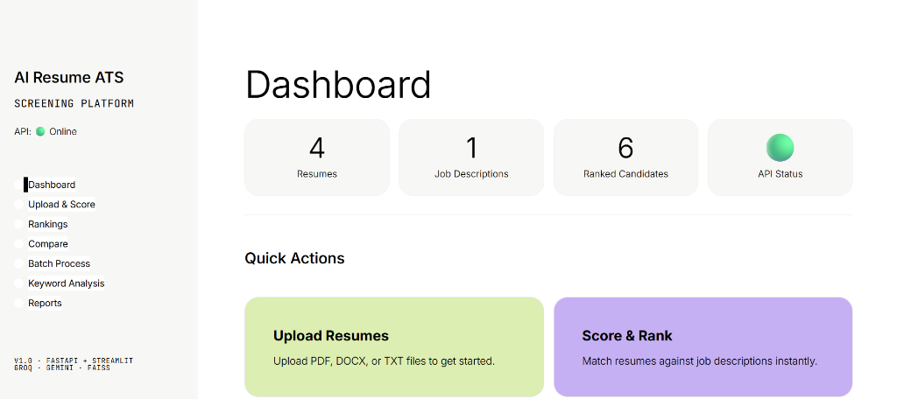
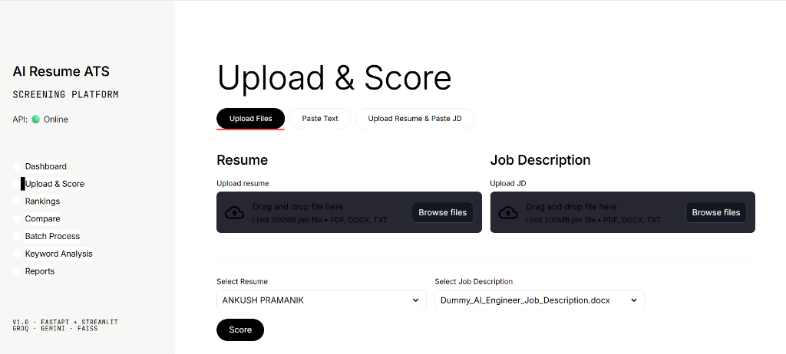
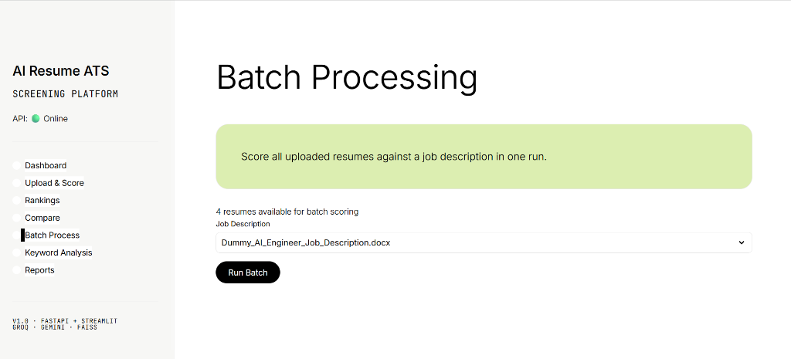

# AI Resume Screening ATS Platform

Production-grade Applicant Tracking System with semantic matching, AI-powered analysis, and an editorial design system.

**Live Demo:** [https://ai-resume-ats-ho41.onrender.com/](https://ai-resume-ats-ho41.onrender.com/)

## Screenshots

### Dashboard


### Upload & Score


### Batch Processing



## Tech Stack

| Layer | Technology |
|-------|-----------|
| Backend | FastAPI (Python) |
| Frontend | Streamlit |
| LLM | Groq Cloud API (Mixtral) |
| Embeddings | Gemini API / Sentence Transformers (fallback) |
| Vector Search | FAISS (cosine similarity) |
| Reports | ReportLab PDF |
| Design | DESIGN.md (Figma monochrome + pastel color-blocks) |

## Features

- Resume upload & parsing (PDF, DOCX, TXT)
- JD upload & parsing
- ATS scoring (keyword + semantic + skills coverage)
- Skill extraction & missing skill detection
- Candidate ranking with FAISS semantic search
- Side-by-side resume comparison
- Keyword frequency analysis
- Batch processing
- PDF report generation
- Dashboard with metrics and charts

## Quick Start

### 1. Install

```bash
pip install -r requirements.txt
```

### 2. Configure

```bash
cp .env.example .env
# Edit .env with your API keys
```

### 3. Run Backend

```bash
uvicorn backend.main:app --reload --port 8000
```

### 4. Run Frontend

```bash
streamlit run frontend/app.py
```

Open `http://localhost:8501` in your browser.

## API Endpoints

| Method | Path | Description |
|--------|------|-------------|
| POST | `/api/upload/resume` | Upload a resume |
| POST | `/api/upload/jd` | Upload a job description |
| POST | `/api/score` | Score a resume against a JD |
| POST | `/api/score/direct` | Score pasted text |
| POST | `/api/compare` | Compare two resumes |
| POST | `/api/batch` | Start batch processing |
| GET | `/api/batch/{job_id}` | Batch status |
| GET | `/api/rankings` | Get candidate rankings |
| GET | `/api/keyword-analysis` | Keyword frequency analysis |
| POST | `/api/report` | Generate PDF report |
| GET | `/api/resumes` | List uploaded resumes |
| GET | `/api/jds` | List uploaded JDs |
| DELETE | `/api/clear` | Clear all data |

## Architecture

```
├── backend/
│   ├── main.py           # FastAPI entry
│   ├── api/routes.py     # API endpoints
│   ├── core/config.py    # Settings
│   ├── models/schemas.py # Pydantic models
│   ├── services/
│   │   ├── parser.py     # Resume/JD parsing
│   │   ├── embeddings.py # Vector embeddings
│   │   ├── llm.py        # Groq LLM analysis
│   │   ├── matcher.py    # FAISS semantic search
│   │   ├── scorer.py     # ATS scoring
│   │   ├── reporter.py   # PDF generation
│   │   └── batch.py      # Batch processing
│   └── utils/
│       ├── logger.py     # Logging
│       └── file_handler.py
├── frontend/
│   ├── app.py            # Streamlit entry
│   ├── pages/            # Page modules
│   └── utils/
│       ├── styling.py    # DESIGN.md CSS tokens
│       └── api_client.py # API client
├── data/                 # Uploads, reports, FAISS index
├── logs/                 # Application logs
├── DESIGN.md             # Design system specification
├── .env.example
└── requirements.txt
```

## Scoring Logic

ATS score = weighted combination of:

- **Keyword Match (30%)** — direct keyword overlap between resume and JD
- **Semantic Match (30%)** — cosine similarity via FAISS embeddings
- **Skills Coverage (20%)** — percentage of required skills present
- **Experience Relevance (10%)** — how well experience aligns
- **Education Match (10%)** — education fit

## Design System

The UI follows `DESIGN.md` — a monochrome editorial frame (black-on-white typography, pill CTAs) punctuated by oversized pastel color-block sections (lime, lilac, cream, mint, coral, navy). See `DESIGN.md` for the full token system.
